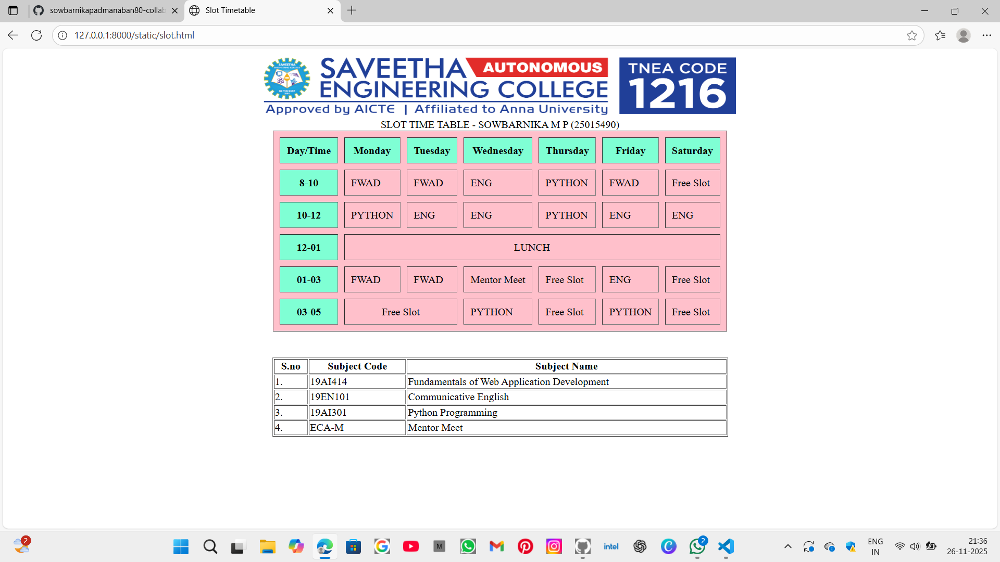

# Ex02 Time Table
## Date:26/11/2025

## AIM
To write a html webpage page to display your slot timetable.

## ALGORITHM
### STEP 1
Create a Django-admin Interface.

### STEP 2
Create an App inside the Django project.

### STEP 2
Create a static folder uder the created App and insert HTML code.

### STEP 3
Create a simple table using ```<table>``` tag in html with the relevant attributes.

### STEP 4
Add rows using ```<tr>``` tag.

### STEP 5
Add your course schedule using ```<td>``` tag.

### STEP 6
Execute the program using runserver command.

## PROGRAM
```
<html>
    <head>
        <title>
            Slot Timetable
        </title>
    </head>
    <body>
        <div style="text-align:center;">
        
        </div>
        
        <table border="1" align="center" cellspacing="10" cellpadding="10" bgcolor="pink">
            <caption>SLOT TIME TABLE - SOWBARNIKA M P (25015490) </caption>
            <tr>
                <th bgcolor="Aquamarine">Day/Time</th>
                <th bgcolor="Aquamarine">Monday</th>
                <th bgcolor="Aquamarine">Tuesday</th>
                <th bgcolor="Aquamarine">Wednesday</th>
                <th bgcolor="Aquamarine">Thursday</th>
                <th bgcolor="Aquamarine">Friday</th>
                <th bgcolor="Aquamarine">Saturday</th>
            </tr>
            <tr>
                <th bgcolor="Aquamarine">8-10</th>
                <td>FWAD</td>
                <td>FWAD</td>
                <td>ENG</td>
                <td>PYTHON</td>
                <td>FWAD</td>
                <td>Free Slot</td>
            </tr>
            <tr>
                <th bgcolor="Aquamarine">10-12</th>
                <td>PYTHON</td>
                <td>ENG</td>
                <td>ENG</td>
                <td>PYTHON</td>
                <td>ENG</td>
                <td>ENG</td>
            </tr>
            <tr>
                <th bgcolor="Aquamarine">12-01</th>
                <td colspan="6" align="center">LUNCH</td>
            </tr>
            <tr>
                <th bgcolor="Aquamarine">01-03</th>
                <td>FWAD</td>
                <td>FWAD</td>
                <td>Mentor Meet</td>
                <td>Free Slot</td>
                <td>ENG</td>
                <td>Free Slot</td>
            </tr>
            <tr>
                <th bgcolor="Aquamarine">03-05</th>
                <td colspan="2" align="center">Free Slot</td>
                <td>PYTHON</td>
                <td>Free Slot</td>
                <td>PYTHON</td>
                <td>Free Slot</td>
            </tr>
        </table>
        <div style="margin-top:40px;"></div>
        <table border="1" align="center" width="700" height="90">
            <tr>
                <th>S.no</th>
                <th>Subject Code</th>
                <th>Subject Name</th>
            </tr>
            <tr>
                <td>1.</td>
                <td>19AI414</td>
                <td>Fundamentals of Web Application Development</td>
            </tr>
            <tr>
                <td>2.</td>
                <td>19EN101</td>
                <td>Communicative English</td>
            </tr>
            <tr>
                <td>3.</td>
                <td>19AI301</td>
                <td>Python Programming</td>
            </tr>
            <tr>
                <td>4.</td>
                <td>ECA-M</td>
                <td>Mentor Meet</td>
            </tr>

        </table>
    </body>
</html>

```

## OUTPUT



## RESULT
The program for creating slot timetable using basic HTML tags is executed successfully.
